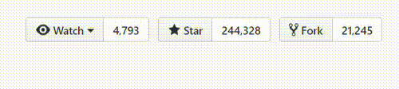

Hướng dẫn Spring Boot
=========================

 
Spring Boot và tất tần tật tất cả mọi thứ liên quan tới nó, bạn đều có thể tìm kiếm tại đây.

Mỗi module đều có hướng dẫn chi tiết đi kèm.

[Spring Boot](https://github.com/loda-kun/spring-boot-learning) &nbsp;| &nbsp; [Java](https://github.com/loda-kun/java-all) &nbsp;| &nbsp; [Github](https://github.com/loda-kun/spring-boot-learning)

[English](https://github.com/loda-kun/spring-boot-learning)

---

## Các bài viết hiện có

- [basic-dependency-loosely-coupled](https://github.com/loda-kun/spring-boot-learning/tree/master/basic-dependency-loosely-coupled): Hướng dẫn loosely coupled
- [spring-boot-1-helloworld-@Component-@Autowired](https://github.com/loda-kun/spring-boot-learning/tree/master/spring-boot-1-helloworld-%40Component-%40Autowired): 「Spring Boot #1」Hướng dẫn @Component và @Autowired
- [spring-boot-2-helloworld-@Primary - @Qualifier](https://github.com/loda-kun/spring-boot-learning/tree/master/spring-boot-2-helloworld-%40Primary%20-%20%40Qualifier): 「Spring Boot #2」@Autowired - @Primary - @Qualifier
- [spring-boot-3-bean-life-cycle-@PostConstruct-@PreDestroy](https://github.com/loda-kun/spring-boot-learning/tree/master/spring-boot-3-bean-life-cycle-%40PostConstruct-%40PreDestroy): 「Spring Boot #3」Spring Bean Life Cycle + @PostConstruct và @PreDestroy
- [spring-boot-4-@Component-@Service-@Repository](https://github.com/loda-kun/spring-boot-learning/tree/master/spring-boot-4-%40Component-%40Service-%40Repository): 「Spring Boot #4」@Component vs @Service vs @Repository
- [spring-boot-5-Component-Scan](https://github.com/loda-kun/spring-boot-learning/tree/master/spring-boot-5-Component-Scan): 「Spring Boot #5」Component Scan là gì?
- [spring-boot-6-@configuration-@Bean](https://github.com/loda-kun/spring-boot-learning/tree/master/spring-boot-6-%40configuration-%40Bean): 「Spring Boot #6」@Configuration và @Bean
- [spring-boot-7-spring-application-properties-@Value](https://github.com/loda-kun/spring-boot-learning/tree/master/spring-boot-7-spring-application-properties-%40Value): 「Spring Boot #7」Spring Boot Application Config và @Value
- [spring-boot-8-@Controller-web-helloworld](https://github.com/loda-kun/spring-boot-learning/tree/master/spring-boot-8-%40Controller-web-helloworld): 「Spring Boot #8」Tạo Web Helloworld với @Controller
- [spring-boot-9-thymeleaf](https://github.com/loda-kun/spring-boot-learning/tree/master/spring-boot-9-thymeleaf): 「Spring Boot #9」Hướng dẫn chi tiết làm Web với Thymeleaf + Demo Full
- :
- :
- [spring-boot-@Lazy-Anotation](https://github.com/loda-kun/spring-boot-learning/tree/master/spring-boot-%40Lazy-Anotation): 「Spring Boot」Annotation @Lazy trong Spring Boot
- [spring-boot-webflux](https://github.com/loda-kun/spring-boot-learning/tree/master/spring-boot-webflux): Xây dựng ứng dụng Reactive với Spring 5 Webflux
- [spring-cloud-config-server](https://github.com/loda-kun/spring-boot-learning/tree/master/spring-cloud-config-server) + [spring-cloud-config-client](https://github.com/loda-kun/spring-boot-learning/tree/master/spring-cloud-config-client): Hướng dẫn cấu hình nhiều properties bằng Spring Cloud Config Server
- [jpa-hibernate-one-to-one](https://github.com/loda-kun/spring-boot-learning/tree/master/jpa-hibernate-one-to-one): Hướng dẫn sử dụng @OneToOne
- [jpa-hibernate-one-to-many](https://github.com/loda-kun/spring-boot-learning/tree/master/jpa-hibernate-one-to-many): Hướng dẫn sử dụng @OneToMany và @ManyToOne
- [jpa-hibernate-many-to-many](https://github.com/loda-kun/spring-boot-learning/tree/master/jpa-hibernate-many-to-many): Hướng dẫn sử dụng @ManyToMany
- [spring-configuration-properties](https://github.com/loda-kun/spring-boot-learning/tree/master/spring-configuration-properties): Hướng dẫn sử dụng Spring Properties
- [spring-redis](https://github.com/loda-kun/spring-boot-learning/tree/master/spring-redis): Hướng dẫn Spring Boot Data + Redis cơ bản
- [spring-security-example](https://github.com/loda-kun/spring-boot-learning/tree/master/spring-security-example): Hướng dẫn Authorization với Spring Security (căn bản)
- [spring-security-hibernate](https://github.com/loda-kun/spring-boot-learning/tree/master/spring-security-hibernate): Hướng dẫn Spring Boot + Security + H2 Database
- [spring-security-hibernate-jwt](https://github.com/loda-kun/spring-boot-learning/tree/master/spring-security-hibernate-jwt): Hướng dẫn String Security + JWT (Json Web Token)

---

## Lí do

Xin chào toàn thể các bạn dev thân mến!

Trong nhiều năm qua, chúng ta nhìn thấy sự lớn mạnh của "nước láng giềng" (Không tiện đề cập) trong lĩnh vực lập trình.

Tôi gần như có thể tìm kiếm hàng tá **repository xịn xò** của họ khi dùng tính năng `Explore` của `Github`. Thì đúng, là Github mà, không tìm thấy code thì tìm thấy gì :))) nhưng cái điểm khác biệt đó là toàn bộ repo đều là **tiếng Trung**!

Tôi nghĩ đây cũng là một trong những yếu tố chính khiến "nước láng giếng" lại có nguồn Developer đông và giỏi chuyên môn như vậy (tạm bỏ qua yếu tố đông dân, xã hội, điều kiện sống, nền tảng giáo dục, v.v.. đúng là có ảnh hưởng nhưng các bạn đọc tiếp đã). 

Họ chia sẻ tài liệu với nhau rộng rãi, hướng dẫn lập trình, open-source hàng tá những project lớn nhỏ, và tất cả đều viết bằng tiếng Trung, comment tiếng trung, quy tắc, mô tả, giải thích, v.v.. mọi thứ đều là ngôn ngữ bản địa. Nó giúp cho bất kì ai trong đất nước họ đều có thể tiếp cận và học tập được những kiến thức này, dễ hiểu mà lại cực kì nhanh.

Tôi không nói rằng Tiếng Anh là không đủ, nhưng nếu cầm trên tay 2 quyển sách tương đương về kiến thức, một tiếng việt, một tiếng anh. Bạn đọc quyển nào trước?

Thế đấy, tôi sẽ bắt đầu chỉa sẽ những repo tiếng việt lên `Github` để tất cả những developer là người Việt có thể tìm hiểu, đọc được và cùng nhau đóng góp. Xây dựng lên một cộng đồng developer Việt Nam ngày càng tốt hơn. 

Hi vọng việc này sẽ giúp đỡ cho các tân binh mới vào nghề dễ dàng tiếp cận kiến thức mới và có lộ trình rõ ràng.

### Giúp đỡ tôi bằng cách chia sẻ hoặc tặng sao

### Thông tin liên hệ 

> Nếu có bất kỳ nội dung nào liên quan tới Spring Boot còn thiếu，hãy tạo [issues](https://github.com/ityouknow/spring-boot-examples/issues) cho nó, tôi sẽ theo dõi và cải thiện。

Mọi thông tin xin liên hệ: [https://loda.me/about](https://loda.me/about)

